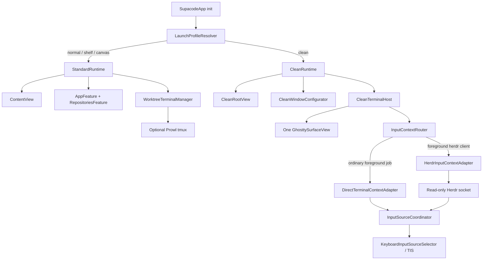

# Prowl Clean Mode 可行性评估与技术方案

日期：2026-08-14
状态：评估完成，待实现

## 1. 结论摘要

Clean Mode 可行，整体风险为中等。推荐在同一个 Prowl app 中增加独立的启动 profile，但不要把 Clean
实现为 Normal、Shelf、Canvas 或 Freestyle 的一种 repository presentation，也不要复用带 tab、split、tmux
和 layout snapshot 语义的 `WorktreeTerminalState`。

推荐方案是：

- 在现有启动选择中增加 `clean`。
- app 启动时把 `defaultViewMode` 解析为 Standard 或 Clean 两种 runtime profile。
- Clean 使用独立的 `CleanRootView` 和 `CleanTerminalHost`，直接持有唯一一个 `GhosttySurfaceView`。
- Clean 启动普通交互式 shell，不自动运行、attach 或控制 Herdr；用户自行输入 `herdr`。
- Clean 主窗口不显示 sidebar、toolbar、tab bar、title、titlebar 和 traffic lights。
- Clean 明确排除所有 Prowl-managed tmux、tab、split 和 terminal layout restore/persistence 功能。
- 输入法策略从现有 terminal manager 中抽出为共享 module。普通 shell 使用现有前台进程判断；检测到前台
  `herdr` client 后，自动启用只读 Herdr socket adapter，以 Herdr focused pane 为识别粒度。
- Herdr 退出或不可用时自动退回普通 terminal 判断；无法可靠判断时保持当前输入法，不做猜测式切换。

Clean 与 Freestyle 的语义不同：Freestyle 是一个不绑定 repository/worktree 固定目录的 Prowl terminal
入口，仍属于 Prowl 的 tab、Canvas 和 terminal state 体系；Clean 是一个不进入上述产品体系的极简宿主。

## 2. 目标与范围

### 2.1 用户可见行为

1. Settings 继续使用现有 `Default View > Launch in` Picker，只增加第四项 `Clean Mode`；不增加单独的
   `Startup Profile` 设置。
2. 选择 Clean 后，在下一次 app 启动时进入 Clean；与现有 default view 语义一致，不在当前进程中热切换。
3. Clean 启动后立即显示一个普通 shell terminal，初始工作目录为用户 home directory。
4. terminal 覆盖整个主窗口，包括原 titlebar、toolbar 和 traffic-light 区域。
5. 主窗口内没有 Prowl sidebar、toolbar、tab bar、empty state、状态面板或提示 UI。
6. 主窗口不显示 close、minimize、zoom traffic lights。
7. 用户在 shell 中手动输入 `herdr` 后进入 Herdr；Prowl 不代替用户启动或 attach Herdr。
8. 输入法根据当前输入目标自动切换：
   - 普通 shell 或命令型程序选择 ABC。
   - 直接运行的 coding agent 恢复该 terminal 对应的输入法。
   - Herdr 内 focused pane 是 agent 时，恢复该 Herdr pane 对应的输入法。
   - Herdr 内 focused pane 是普通 shell/command 时，选择 ABC。
9. 系统 app menu 保留 Settings、Quit 和 macOS 标准 Window 能力；这些不是主窗口内的 Prowl chrome。

### 2.2 首期保留能力

| 能力 | 说明 |
|---|---|
| Ghostty terminal rendering | 字体、theme、background opacity、文本输入、selection、clipboard 和 terminal protocol |
| 单一普通 shell | 不注入启动命令，不自动运行 Herdr |
| 自动输入法切换 | 支持直接 agent 和 Herdr focused pane |
| Window lifecycle | 打开、隐藏、重新唤起、resize、native fullscreen、window frame restore |
| Settings / Quit | 用于更改下一次启动 profile 和正常退出 app |
| App 级更新与 crash reporting | 沿用全局设置；不等同于迁移 Prowl repository 功能 |

### 2.3 首期明确不包含

- Repository/worktree 加载、选择、刷新、watcher 和 Git/GitHub/PR 能力。
- Sidebar、toolbar、Command Palette、Active Agents panel、Canvas、Shelf 和 Freestyle UI。
- Prowl terminal tab、split、tab title/icon 和 terminal notification UI。
- Custom command、run script、setup/archive script 和 open-in-editor。
- Prowl CLI socket 及 `prowl` CLI 对 Clean terminal 的寻址和控制。
- Anonymous tmux-backed terminal、tmux restore/attach、detached card recovery。
- Prowl terminal layout snapshot restore、save 和 close confirmation policy。
- 自动运行、自动 attach、启动参数管理或生命周期控制 Herdr。
- Named Herdr session、自定义 `HERDR_SOCKET_PATH` 和 remote Herdr。
- Clean 与 Standard 在同一次 app 运行中的热切换。

用户仍可在普通 shell 中手动运行 `tmux`。互斥约束针对 Prowl-managed tmux 功能：Clean 不创建、不 attach、
不恢复、不持久化任何 Prowl tmux state，也不因全局 `useAnonymousTmuxBackedTerminals` 设置而改变 shell。

## 3. 现有实现评估

### 3.1 启动 view 选择只覆盖 Standard presentation

`supacode/Features/Settings/Models/DefaultViewMode.swift:6` 当前定义三个 case：

```swift
enum DefaultViewMode: String, CaseIterable, Identifiable, Codable, Sendable {
  case normal
  case shelf
  case canvas
}
```

`AppFeature.applyDefaultViewMode` 在 repository 加载/恢复之后发送 Shelf 或 Canvas action。这个时机假设 runtime
已经进入 `AppFeature + RepositoriesFeature + WorktreeTerminalManager`。Clean 要在这些 module 启动之前决定 root
和依赖，因此不能只在 `applyDefaultViewMode` 中增加一个 reducer action。

### 3.2 当前主窗口始终挂载完整 Prowl root

`supacode/App/supacodeApp.swift:774` 的唯一 main `Window` 始终构建 `ContentView`；
`supacode/App/ContentView.swift:19` 随后构建 `NavigationSplitView`、Sidebar、Worktree detail、Command Palette 和
各种 sheet/alert。仅把 sidebar 隐藏不会停止这些 view 和 reducer 的生命周期，也不会释放 toolbar/titlebar
占用的布局区域。

### 3.3 当前 app bootstrap 大部分是无条件的

`supacode/App/supacodeApp.swift:172` 在读取 settings 后立即初始化：

- Ghostty runtime 和 shortcut manager。
- `WorktreeTerminalManager` 与 `TmuxTerminalController`。
- `WorktreeInfoWatcherManager`。
- pull request refresh coordinator。
- `AppFeature` store。
- CLI socket server。
- memory watchdog。
- Settings window manager。

`AppFeature.appLaunched` 还会同时启动 repository、settings、updates、terminal events 和 worktree watcher effect。
如果 Clean 只替换主窗口 view，这些服务仍然运行，视觉上虽干净，runtime 并不精简。

### 3.4 Freestyle 不能作为 Clean 的基础语义

`supacode/Domain/FreestyleTerminal.swift` 用 synthetic worktree `__freestyle__` 表示 home directory terminal。
`WorktreeDetailView` 仍用 `WorktreeTerminalTabsView` 渲染它，而后者在 `onAppear` 中自动执行：

```swift
state.ensureInitialTab(focusing: false)
```

因此 Freestyle 仍带有：

- `WorktreeTerminalState` 和 tab model。
- Terminal tab bar。
- Prowl split action。
- Canvas card 和 focus integration。
- tmux-backed tab 分支。
- terminal layout 和 notification 相关 state。

Freestyle 可以证明 Ghostty terminal 不必绑定真实 repository，但不能证明它满足 Clean 的隔离要求。

### 3.5 输入法执行策略可复用，context source 需要扩展

现有输入法实现分为三层：

| Module | 当前职责 |
|---|---|
| `KeyboardInputSourceSelector` | 通过 Carbon TIS 读取和选择系统 input source |
| `TerminalInputSourceCoordinator` | 在 chat/command context 间切换，并按 surface 保存 chat 输入法 |
| `TerminalInputContextClassifier` | 通过 foreground job、agent process 和 viewport 判断 terminal context |

现有 coordinator 的核心策略满足 Clean 需求：

```swift
switch context {
case .chatAgent:
  restoreChatInputSourceIfNeeded(surfaceID: surfaceID, reason: reason)
case .commandLike:
  _ = selector.selectABC()
case .unknown:
  break
}
```

但它的 target identity 是 `UUID` surface。Herdr 的多个 pane 都位于同一个外层 Ghostty surface 内，切换
Herdr pane 不会产生 Ghostty surface focus 变化，foreground process 通常也只显示外层 `herdr` client。
因此执行策略可以共享，Herdr context 必须来自 Herdr 自己的 focused pane，而不是外层 viewport 猜测。

### 3.6 Herdr 已提供足够的只读接口

本机 Herdr 源码和 Socket API 文档提供以下能力：

- `session.snapshot` 返回 `focused_pane_id`、pane 和 agent records。
- `pane.current` 在省略 caller pane 时返回 active focused pane。
- `PaneInfo` 包含 `pane_id`、`focused`、`agent` 和 `agent_status`。
- `events.subscribe` 支持 `pane.focused`、`pane.updated`、`pane.agent_detected`、
  `pane.agent_status_changed`、`pane.closed` 和 `pane.moved`。
- Unix transport 是 newline-delimited JSON over Unix domain socket。
- bare `herdr` 使用 default session，默认 socket 为 `~/.config/herdr/herdr.sock`；
  `XDG_CONFIG_HOME` 存在时使用 `$XDG_CONFIG_HOME/herdr/herdr.sock`。

这允许 Prowl 做只读、事件驱动的 input context integration，无需控制 Herdr，也无需解析 TUI 文本。

## 4. 可行性结论

| 子目标 | 可行性 | 风险 | 说明 |
|---|---|---|---|
| 启动选择增加 Clean | 高 | 低 | Settings Codable enum 可向后兼容增加 case |
| 单一普通 shell surface | 高 | 低 | `GhosttySurfaceView` 已支持直接创建 shell surface |
| 不加载 Prowl 产品 UI | 高 | 中 | 需要把 main Scene/root 从 `ContentView` 分叉 |
| 真正减少后台 module | 高 | 中 | 需要重构当前无条件 app bootstrap |
| terminal 占满原 chrome 区域 | 高 | 中 | 需要同时处理 NSWindow style 和 SwiftUI safe area |
| 隐藏 traffic lights | 高 | 低 | AppKit standard window button 可单独隐藏 |
| 保留 resize/fullscreen/window restore | 高 | 中 | 必须保留 titled/resizable style，不能使用 borderless shortcut |
| Clean 与 Prowl tmux 互斥 | 高 | 低 | 独立 host 不持有 `TmuxTerminalController` 即可结构性保证 |
| 普通 terminal 输入法切换 | 高 | 低 | 复用现有 selector/coordinator/classifier |
| Herdr pane 级输入法切换 | 高 | 中 | API 足够；风险来自 socket timing 和跨 repo protocol 兼容 |
| Standard mode 零回归 | 中高 | 中 | root/bootstrap 分叉是主要回归面，需要保持 Standard 路径原样 |

总体判断：技术上没有硬阻塞。主要工作不是绘制一个空 view，而是把启动 profile 提前到 app bootstrap，避免
Clean 继续携带 Standard runtime；其次是正确处理 full-size window content 和 Herdr pane identity。

## 5. 方案比较

### 5.1 方案 A：复用 `WorktreeTerminalState`，隐藏 Prowl UI

做法：创建 Clean synthetic worktree/state，复用现有 tab/surface 创建，然后不显示 sidebar 和 tab bar。

优点：

- 初始代码量较少。
- Ghostty callback、focus、config reload 和输入法事件已有实现。

缺点：

- Clean 会隐式拥有 tab、split、tmux、layout snapshot 和 worktree 语义。
- 必须在多个 reducer、command、persistence 和 terminal callback 中增加 `isClean` guard。
- tmux 互斥只能靠运行时条件，容易在后续功能演进时失效。
- 删除 UI 不会停止 repository、watcher、PR、CLI 等后台工作。
- Clean 的维护成本会随 Standard 功能数量增长。

结论：不推荐。它优化了首个 diff，但破坏长期隔离目标。

### 5.2 方案 B：同一 app 内的独立 Clean root 和 terminal host

做法：启动时选择 Standard 或 Clean runtime。Clean 直接持有一个 Ghostty surface，不依赖
`RepositoriesFeature`、`WorktreeTerminalManager` 或 Tmux module。

优点：

- 与现有 Settings、app bundle、签名、Sparkle 和发布流程共存。
- Clean 的 interface 很小，tmux/tab/split 互斥由依赖图保证。
- Standard 和 Clean 的 feature migration 可以按需、显式进行。
- Herdr 只读 adapter 可独立测试，且仅在自动检测到 Herdr 时启用。
- 后续若迁移功能，每项都必须主动跨过 Clean seam，不会被现有 root 自动带入。

缺点：

- 需要重构 `SupacodeApp.init` 的无条件 bootstrap。
- Settings window 需要能在两种 runtime 下打开。
- Ghostty 单 surface 所需的少量 focus/config/window callback 要从现有 state 中抽出或重新组合。

结论：推荐。它在隔离程度、实现成本和单 app 体验之间最平衡。

### 5.3 方案 C：独立 `Prowl Clean` app target

优点：

- 编译和进程层面的最强隔离。
- Clean 不可能意外初始化 Standard runtime。

缺点：

- 增加 bundle identifier、签名、notarization、Sparkle appcast、安装和发布维护。
- Settings 和 Ghostty resources 需要共享或复制。
- “启动时选择 mode”会变成两个 app 的选择，不符合现有产品入口。
- 当前只有一个 Clean-specific 功能，不足以抵消双 target 成本。

结论：当前不采用。只有当 Clean 拥有独立发布节奏或依赖集合时再重新评估。

## 6. 推荐架构



### 6.1 启动 profile 必须早于 reducer restore

`启动 profile` 只是内部 runtime 边界，不需要成为第二个用户可见概念。Settings UI 仍使用现有单选项：

```text
Default View
  Launch in: [Normal View | Shelf View | Canvas View | Clean Mode]
```

因此持久化模型继续沿用 `defaultViewMode`，仅在 `DefaultViewMode` 增加 `case clean`：

```swift
enum DefaultViewMode: String, CaseIterable, Identifiable, Codable, Sendable {
  case normal
  case shelf
  case canvas
  case clean
}
```

`AppearanceSettingsView` 当前通过 `ForEach(DefaultViewMode.allCases)` 生成 Picker item，增加 enum case 和
`title == "Clean Mode"` 后即可自然出现第四项，不需要为 Clean 增加额外 Toggle 或 Settings section。

但 `.clean` 不能进入现有 `AppFeature.applyDefaultViewMode`，因为该函数执行时 Standard repository runtime 已经启动。
app init 应在构造 Standard-only dependencies 和 reducer restore 之前读取 settings，并立即解析：

```swift
enum AppLaunchProfile: Equatable, Sendable {
  case standard(initialViewMode: StandardViewMode)
  case clean
}
```

`StandardViewMode` 只包含 `normal / shelf / canvas`。`LaunchProfileResolver` 是唯一把持久化
`DefaultViewMode` 映射到 runtime profile 的位置，从类型上避免 `.clean` 被发送给 repository reducer。

映射关系为：

| `DefaultViewMode` | 内部 `AppLaunchProfile` |
|---|---|
| `.normal` | `.standard(initialViewMode: .normal)` |
| `.shelf` | `.standard(initialViewMode: .shelf)` |
| `.canvas` | `.standard(initialViewMode: .canvas)` |
| `.clean` | `.clean` |

设置更改只影响下一次 app launch。这样避免在同一进程中销毁/重建 Ghostty runtime、socket server、watcher 和
TCA effect tree，也与当前 “Launch in” 的用户预期一致。用户在 Standard 或 Clean 中都可通过系统 Settings
窗口修改该 Picker；例如在 Clean 中选回 `Normal View` 后，下次启动回到 Standard runtime。

### 6.2 Runtime 依赖分层

建议把启动依赖分为三组：

| 层 | 依赖 |
|---|---|
| Common runtime | Settings persistence、Ghostty init/runtime、Ghostty shortcut config、app delegate、window reopen、Settings/Quit、update/crash infrastructure |
| Standard runtime | `AppFeature` 完整 effect、repository loader、worktree watcher、PR coordinator、CLI server、`WorktreeTerminalManager`、`TmuxTerminalController`、layout persistence |
| Clean runtime | `CleanTerminalHost`、`CleanWindowConfigurator`、共享 input-source policy、按需 Herdr read-only adapter |

实现上应优先把 Standard 现有构造过程封装进 `StandardRuntime`，保持内部行为和依赖不变；不要在大量现有
initializer 中加入 `if !isClean`。Clean runtime 不构造 Standard-only objects，而不是构造后不使用。

Settings window 是 Common runtime。若现有 `SettingsWindowManager` 对 `StoreOf<AppFeature>` 耦合过深，应把其
外部 interface 收窄为打开窗口所需的 Settings store 和 shortcut dependencies，而不是让 Clean 初始化完整
`AppFeature` 仅为打开 Settings。

### 6.3 `CleanTerminalHost`

`CleanTerminalHost` 是 `@MainActor @Observable` module，直接拥有一个 `GhosttySurfaceView`。建议 interface：

```swift
@MainActor
@Observable
final class CleanTerminalHost {
  private(set) var surface: GhosttySurfaceView

  func start()
  func updateWindowActivity(_ activity: WindowActivityState)
  func reevaluateInputContext(reason: InputContextReason)
  func stop()
}
```

内部创建 surface 时：

- `workingDirectory` 使用 `FileManager.default.homeDirectoryForCurrentUser`。
- `initialInput` 为 `nil`。
- `command` 为 `nil`，由 Ghostty 启动普通交互式 shell。
- `context` 使用 `GHOSTTY_SURFACE_CONTEXT_WINDOW`。
- 不创建 `Worktree`、`TerminalTabItem`、`SplitTree` 或 tmux target。
- 不注册 new-tab/new-split/goto-tab callback。
- 注册 focus、occlusion、config reload、key input、command finished 和 close 所需的最小 callback。
- 通过现有 `GhosttyTerminalView(surfaceView:)` 嵌入 SwiftUI，复用 scroll、Metal attachment 和 accessibility
  基础设施。

`CleanRootView` 只渲染 terminal 和必要的 invisible AppKit bridge：

```swift
GhosttyTerminalView(surfaceView: host.surface)
  .frame(maxWidth: .infinity, maxHeight: .infinity)
  .ignoresSafeArea(.container, edges: .top)
  .background(CleanWindowConfigurator())
```

实际 modifier 顺序需通过截图和 hit-testing 验证，目标是不引入任何可见 overlay。

### 6.4 Window chrome 与 full-bleed layout

删除 SwiftUI toolbar/sidebar/tab bar 不足以占用原 chrome 空间。macOS window 仍可能通过 titlebar layout guide 和
safe area 给 content 保留顶部 inset。Clean 需要同时完成两层配置。

#### NSWindow 层

`CleanWindowConfigurator` 只配置附着它的 main Clean window：

```swift
window.styleMask.insert(.fullSizeContentView)
window.titleVisibility = .hidden
window.titlebarAppearsTransparent = true
window.toolbar = nil

for button in [
  NSWindow.ButtonType.closeButton,
  .miniaturizeButton,
  .zoomButton,
] {
  window.standardWindowButton(button)?.isHidden = true
}
```

保留 `.titled`、`.closable`、`.miniaturizable` 和 `.resizable` style：

- `.fullSizeContentView` 让 content layout 延伸进 titlebar 区域。
- 隐藏 standard buttons 只改变可见 chrome，不删除窗口能力。
- 保留 titled/resizable style 以维持 edge resize、Window menu、native fullscreen、Mission Control、frame autosave
  和 `Cmd+W`。
- 不使用 `.borderless`，因为 borderless 会扩大窗口生命周期、键盘和空间管理回归面。

#### SwiftUI/AppKit content 层

- Clean scene 不挂载 `ContentView` 和任何 toolbar modifier。
- terminal root 忽略 top container safe area。
- Ghostty scroll wrapper 和 surface frame 必须跟随 window content bounds，包括原 traffic-light 区域。
- Settings 等其他窗口不挂载 `CleanWindowConfigurator`，继续使用标准 chrome。

#### Window drag 取舍

full-size interactive terminal 会占据整个 titlebar 区域。透明 titlebar 是否仍能可靠接收 window drag，取决于
AppKit hit-testing 和 Ghostty NSView 的事件处理，必须在实现阶段实机验证。

首期优先级：

1. terminal 的第一行和整个 surface 保持完整鼠标输入。
2. edge resize、Window menu、native fullscreen 和系统窗口管理可用。
3. 若透明 titlebar 可以在不抢 terminal mouse event 的前提下 drag，则保留。
4. 若二者冲突，不增加会吞掉 terminal 首行鼠标事件的 invisible drag strip；窗口移动使用 macOS Window menu、
   tiling 或 Mission Control。后续可单独设计 modifier-assisted drag。

这个取舍避免“视觉上占满”但顶部存在一条不可解释的 mouse dead zone。

### 6.5 Prowl tmux 互斥

互斥应由 module dependency 保证，不依赖 setting 组合判断。

Clean runtime 必须满足：

- 不构造 `TmuxTerminalController`。
- 不调用 `WorktreeTerminalState.createTabAsync` 的 tmux-backed 分支。
- 不读取或应用 `useAnonymousTmuxBackedTerminals`。
- 不提供 Restore Running Tab、detached card recovery 或 tmux metadata。
- 不执行 `restoreTerminalLayoutOnLaunch`。
- app inactive/terminate 时不保存 Clean surface 到 Prowl terminal layout snapshot。
- 不把 Clean surface 暴露给 Prowl CLI target resolver。

全局 tmux settings 不被 Clean 修改。用户以后切回 Standard，原 setting 仍生效。这样互斥不会造成持久化配置丢失。

### 6.6 输入法 policy 抽取

当前 `TerminalInputSourceCoordinator` 同时绑定 policy 和 surface UUID。Clean/Herdr 引入第二种真实 adapter 后，
应建立一个共享 seam：

```swift
enum InputSourceTargetID: Hashable, Sendable {
  case ghosttySurface(UUID)
  case herdrPane(String)
}

enum TerminalInputContext: Equatable, Sendable {
  case chatAgent
  case commandLike
  case unknown
}
```

共享 coordinator 的 interface 接收 `(context, targetID, reason)`，继续负责：

- 离开 chat target 时保存当前 input source。
- 进入已有 chat target 时恢复其 input source。
- 进入 command target 时选择 ABC。
- unknown 时保持不变。

Standard adapter 用 `.ghosttySurface(UUID)`，行为保持不变。Clean 中直接 agent 也使用 surface UUID；只有进入
Herdr 后，target identity 切换为 `.herdrPane(paneID)`，从而为不同 Herdr pane 分别记忆输入法。

### 6.7 自动识别 Herdr，而不是把 Clean 写死为 Herdr

`CleanTerminalHost` 的 context router 根据外层 Ghostty surface 的 foreground job 动态选择 adapter：

```text
普通 shell / command / direct agent
  -> DirectTerminalContextAdapter

foreground executable basename == "herdr"
  -> HerdrInputContextAdapter

herdr process exits
  -> cancel Herdr subscription
  -> DirectTerminalContextAdapter
```

检测使用 process basename 和 argv token，不使用 window title 或 viewport 字符串。这样：

- Clean 可以长期停留在普通 shell，不会连接 Herdr。
- 用户手动输入 `herdr` 后自动启用 pane 级 context。
- 用户 detach/exit Herdr 后自动回到普通判断。
- Standard terminal 将来也可以复用同一 router；首期只在 Clean 启用以限制改动范围。

检测触发点：

- Clean surface 获得 focus。
- app becomes active。
- 用户提交 terminal key input 后的现有 agent-detection wakeup。
- Ghostty command-finished callback。
- foreground job 监测结果发生变化。

异步 probe 必须使用 request token 丢弃过期结果，沿用 `WorktreeTerminalManager.InputSourceFocusRequest` 的 race
防护思路，避免快速切换时旧 task 改错输入法。

### 6.8 Herdr 只读 socket adapter

首期只支持用户在 Clean shell 中执行 bare `herdr`，因此连接 default session：

```text
$XDG_CONFIG_HOME/herdr/herdr.sock
或
$HOME/.config/herdr/herdr.sock
```

adapter 不执行 `herdr` CLI，不启动 server，不发送 control method。建议数据流：

1. 检测到 foreground `herdr`。
2. 解析 default socket path。
3. 建立 request connection，发送 `pane.current` 获取 focused `PaneInfo`。
4. 建立 subscription connection，订阅 `pane.focused`、`pane.updated`、`pane.agent_detected`、
   `pane.agent_status_changed`、`pane.closed` 和 `pane.moved`。
5. 收到相关 event 后进行短 debounce，再次调用 `pane.current`，避免在 Prowl 侧复制完整 Herdr state cache。
6. 映射 context：

```swift
let context: TerminalInputContext =
  pane.agent == nil ? .commandLike : .chatAgent
```

7. 使用 `.herdrPane(pane.paneID)` 调用共享 input-source coordinator。
8. socket 断开时取消 subscription 并进行有上限的 backoff reconnect；重连后重新读取 `pane.current`。
9. 外层 foreground process 不再是 Herdr 时立即停止 adapter，不因 Herdr server 仍在后台而继续应用 pane context。

不使用 `agent_status` 区分 chat/command。`idle / working / blocked / done / unknown` 都可能仍是一个需要自然语言
输入的 agent；是否存在 `agent` 才对应现有 direct-agent classifier 的语义。

#### 失败策略

| 失败 | 行为 |
|---|---|
| socket 文件尚未出现 | backoff retry；input context 为 unknown，保持当前输入法 |
| Herdr server 未运行 | 保持当前输入法，不显示 Prowl overlay |
| JSON decode 失败 | `SupaLogger` 记录 protocol/context，保持当前输入法 |
| protocol version 不兼容 | 停止本次 adapter，保持当前输入法 |
| event subscription 断开 | 重连后重新读取 current pane |
| focused pane 暂时不存在 | unknown，保持当前输入法 |
| Herdr 退出 | 取消 adapter，重新 probe 外层 shell |

Herdr 是跨 repository protocol dependency。Swift decoder 应忽略未知字段，只依赖 `pane_id`、`agent` 和必要的
response envelope；同时通过 `ping` 或 snapshot protocol 字段做兼容检查。不要复制 Herdr 的完整 schema。

## 7. 改动范围

### 7.1 预计新增 module/file

| 路径建议 | 职责 |
|---|---|
| `supacode/App/AppLaunchProfile.swift` | 持久化 default mode 到 Standard/Clean runtime 的唯一映射 |
| `supacode/App/StandardRuntime.swift` | 封装现有 Standard-only bootstrap |
| `supacode/Features/Clean/CleanRootView.swift` | Clean main-window root |
| `supacode/Features/Clean/CleanTerminalHost.swift` | 单 Ghostty surface 生命周期 |
| `supacode/Features/Clean/CleanWindowConfigurator.swift` | NSWindow chrome/full-size content 配置 |
| `supacode/Infrastructure/InputSource/InputContextRouter.swift` | direct/Herdr adapter 动态路由 |
| `supacode/Infrastructure/Herdr/HerdrInputContextAdapter.swift` | Herdr process detection、socket lifecycle 和 context stream |
| `supacode/Infrastructure/Herdr/HerdrSocketClient.swift` | 最小 NDJSON request/subscription client |
| `supacode/Infrastructure/Herdr/HerdrWireModels.swift` | 最小 Codable wire model |

文件名可按实现时的 module 组织调整，但职责不能重新合并进 `ContentView` 或 repository reducer。

### 7.2 预计修改的现有区域

| 现有区域 | 改动 |
|---|---|
| `DefaultViewMode.swift` | 增加 `clean` 和显示标题 |
| `AppearanceSettingsView.swift` | 更新 Launch in help 和 Clean 描述 |
| `GlobalSettings.swift` | 验证新 enum case 的 Codable/backward compatibility |
| `supacodeApp.swift` | 提前解析 profile，按 profile 构造 runtime 和 Scene/commands |
| `SupacodeAppDelegate` | app activation/termination 按 active runtime 转发，不保存 Clean layout |
| `SettingsWindowManager` | 若需要，收窄为 Common runtime 可配置 interface |
| `TerminalInputSourceCoordinator.swift` | target identity 从 surface UUID 泛化为 typed ID |
| `TerminalInputContextClassifier.swift` | 保持 direct classifier；增加精确 Herdr process route 或拆到 router |
| Xcode project | 注册新增 Swift file |

### 7.3 原则上不应修改

- `RepositoriesFeature` reducer 和 repository loading/selection。
- `CanvasView`、`ShelfView` 和 Freestyle selection。
- `WorktreeTerminalState` 的 tab/split/tmux 行为。
- `TmuxTerminalController`。
- Standard terminal layout snapshot payload。
- Prowl CLI command/response schema。

如果实现需要在这些区域增加多处 `clean` 分支，说明 startup seam 放置过晚，应回到 runtime/root 分叉重做。

### 7.4 文档改动

实现时同步更新：

- `docs/components/view-modes.md`：加入 Clean，并明确它不是相同 worktree session 的布局切换。
- `docs/components/settings.md`：更新 Launch in 行为。
- `docs/reference/settings-fields.md`：`defaultViewMode` enum 增加 `clean`。
- 新增 Clean 用户文档：启动、退出、无 traffic lights 的窗口操作和 Herdr 手动进入方式。

## 8. 主要取舍与影响

### 8.1 同一 app，而不是独立 target

收益：复用安装、签名、notarization、Sparkle、Settings 和 Ghostty resources。代价：必须认真拆分 bootstrap，
否则 Clean 只是 UI facade。推荐接受一次受控的 runtime 分层，而不是承担长期双 app 发布成本。

### 8.2 独立 surface host，而不是现有 terminal state

收益：依赖图中完全没有 Prowl tab/tmux/layout，互斥可靠。代价：需要组合 focus、occlusion、config reload 和
close callback。应复用底层 `GhosttySurfaceView`/`GhosttyTerminalView`，不要复制 Ghostty bridge 实现。

### 8.3 无 traffic lights 的可发现性

影响：用户失去可见 close/minimize/zoom affordance。保留系统 menu、keyboard command、Dock 和 native window
management 可以维持操作能力，但可发现性下降。Clean 的目标本身要求这个取舍，用户文档必须写明。

### 8.4 full-bleed 与 window drag

影响：任何可拖动区域都会与 terminal 顶部 mouse input 竞争。方案优先 terminal 完整输入和无 dead zone，不承诺
传统 titlebar drag。实现测试若发现 AppKit 可无冲突保留 drag，则作为自然收益保留，不为 drag 引入可见 UI。

### 8.5 Herdr socket coupling

收益：focused pane 判断准确，避免 multipane viewport 误识别。代价：Prowl 依赖 Herdr 的本地 socket protocol 和
path convention。通过最小 wire model、protocol check、unknown fallback 和 contract fixture 控制风险。

### 8.6 不自动运行 Herdr

收益：Clean 仍是通用普通 terminal，不绑定 Herdr 安装路径、session 或启动失败处理；用户完全控制进入时机。
代价：每次新 Clean shell 需要手动输入一次 `herdr`。这是首期明确行为，不增加隐藏 automation。

### 8.7 Clean 忽略 Prowl tmux setting

收益：Herdr 成为唯一的外层 session/layout owner，避免 nested Prowl tmux 和 Herdr 的恢复、焦点、生命周期冲突。
代价：用户在 Standard 中开启的 anonymous tmux setting 对 Clean 不生效。setting 本身不被修改，切回 Standard
后继续生效。

### 8.8 启动时选择，不支持热切换

收益：runtime ownership 清晰，不需要在运行时关闭 socket server、watcher、repository effects 或重建 Ghostty。
代价：更改 mode 后需要重启 app。与设置名称 “Launch in” 一致，首期可接受。

### 8.9 实现基线选择 `custom`，不选择与 `main` 的公共祖先

Clean 首期唯一需要迁移的产品能力是 `custom` 已有的自动输入法切换。该实现不在 `custom` 与 `main` 的公共祖先
中；若从公共祖先开始，会先丢失目标依赖，再被迫重复移植或 cherry-pick 输入法改动，既扩大工作量，也制造两套
可能分叉的实现。

实现时应从当时本地当前 `custom` HEAD 创建独立工作分支，例如 `codex/clean-mode`，所有 Clean 改动只落在这个
分支，完成后集成回 `custom`。不要同时在 `custom` 和公共祖先上分别实现，也不要为了开始 Clean 执行
`fetch`、`pull`、`rebase`、merge `main` 或同步最新 upstream。

评估时本地关系为：`main`/公共祖先是 `4a39868b`，`custom` 是 `a8a63678`，后者已包含自动输入法相关提交。因此
选择 `custom` 不是为了携带所有定制功能，而是为了以 Clean 所需能力的真实现状作为唯一实现基线。未来若需要把
Clean 移向其他 branch，应在本功能稳定后单独处理，不与首期实现混在一起。

## 9. 实施阶段

### Phase 1：建立启动 seam 和 full-bleed Clean shell

1. 增加 `clean` setting 和 `AppLaunchProfile`。
2. 把 Standard bootstrap 封装到独立 runtime，保持行为不变。
3. 新建 `CleanRuntime`、`CleanRootView`、`CleanTerminalHost`。
4. 新建 `CleanWindowConfigurator`，完成 full-size content 和 traffic-light 隐藏。
5. 保证 Clean 只创建一个普通 shell surface，不构造 Tmux/Repository/CLI dependencies。
6. 保留 Common Settings/Quit/update/window lifecycle。

### Phase 2：抽取共享输入法 policy

1. 把 coordinator target key 泛化为 typed `InputSourceTargetID`。
2. 保持 Standard surface UUID 行为和测试不变。
3. 为 Clean surface 接入 direct terminal context probe。
4. 增加 async request token，防止过期 probe 应用。

### Phase 3：Herdr 自动识别和 pane context

1. 增加 exact Herdr foreground process detection。
2. 实现 default socket path resolver 和最小 NDJSON client。
3. 实现 `pane.current` bootstrap 和 lifecycle event subscription。
4. 用 `pane_id`/`agent` 驱动 input-source coordinator。
5. 完成 disconnect、backoff、protocol mismatch 和 Herdr exit fallback。

### Phase 4：验证和用户文档

1. 完成 unit/reducer/contract tests。
2. 验证 Standard 三种 view 和 Freestyle 无回归。
3. 对 Clean 做多尺寸窗口截图和 AppKit hit-testing。
4. 更新 settings/view-mode/reference/Clean 文档。
5. 按 app-side 流程运行 `make install-dev-build` 验证并安装 Debug app。

## 10. 测试方案

### 10.1 Unit tests

- `DefaultViewMode.clean` Codable round trip。
- 旧 settings 缺少/包含 `normal/shelf/canvas` 时解析不变。
- `LaunchProfileResolver` 只把 Clean 映射到 Clean runtime。
- `CleanTerminalHost` 只调用一次 surface factory，参数为 home、nil command、nil initial input、window context。
- Clean runtime 的 fake tmux/repository/CLI factories 调用次数为 0。
- `InputSourceTargetID` 在 surface 和 Herdr pane 之间切换时正确保存/恢复输入法。
- Herdr process basename/argv 精确匹配，避免把包含 `herdr` 的无关进程误判。
- Herdr wire decoder 覆盖 `pane.current`、focused event、agent detected/released、agent status 和未知字段。
- `agent == nil` 映射 command；`agent != nil` 映射 chat，不受 status 值影响。
- socket unavailable/decode error/protocol mismatch 映射 unknown，不调用 selector。
- reconnect 使用 injected clock/TestClock，不使用 `Task.sleep`。
- 过期 foreground probe 和过期 pane response 不应用输入法。

### 10.2 Reducer/runtime tests

- Standard `.appLaunched` effect 集合保持现状。
- Clean launch 不加载 repository、不启动 worktree watcher、不启动 Prowl CLI socket。
- Clean inactive/terminate 不读取或保存 Prowl terminal layout。
- 全局 anonymous tmux 开启时 Clean 仍不构造 tmux controller。
- Settings 从 Clean 可打开，修改 default launch mode 后持久化，但当前 root 不热切换。

### 10.3 Window/UI verification

至少覆盖普通窗口、zoomed、native fullscreen 和退出 fullscreen：

- surface 顶边到 window 顶边无 titlebar/safe-area 空白。
- 原 traffic-light 区域渲染 terminal 内容。
- close/minimize/zoom buttons 均不可见。
- sidebar、toolbar、tab bar 和 Prowl overlay 不存在。
- terminal 文本首行没有被裁切，mouse selection 可覆盖顶部行。
- edge resize、`Cmd+W`、Window menu、Dock reopen 和 frame restore 可用。
- key window 切换和 app reactivation 后 cursor/focus 正确。
- transparent titlebar drag 行为被记录；不能以牺牲 terminal 顶部 mouse input 的方式修复。
- Settings window 仍显示标准 traffic lights 和 titlebar。
- light/dark、background opacity 和不同 display scale 下无 1px seam 或空白带。

### 10.4 Herdr integration verification

- Clean 普通 shell 启动时不连接 Herdr socket。
- 手动运行 bare `herdr` 后自动连接 default socket。
- focused shell pane 选择 ABC。
- focused agent pane 恢复该 `pane_id` 已保存的输入法。
- 两个 agent pane 分别记忆输入法。
- 快速切 pane 不会被旧 response 回滚。
- detach/exit Herdr 后停止 subscription，并恢复外层 shell 判断。
- Herdr server 保持后台运行时，外层不在 Herdr 也不会继续应用 pane context。

## 11. 验收标准

实现完成需同时满足：

1. 用户可以在 Settings 选择 Clean，并在下一次启动进入 Clean。
2. Clean 启动显示唯一一个 home-directory 普通 shell surface，无自动 Herdr command。
3. terminal 视觉上占满整个主窗口，包括原 titlebar 和 traffic-light 区域。
4. 主窗口没有 Prowl sidebar、toolbar、tab bar、title 和 traffic lights。
5. Clean runtime 不构造或调用 Prowl Repository、Worktree watcher、CLI、Tmux 和 layout persistence module。
6. `useAnonymousTmuxBackedTerminals` 和 `restoreTerminalLayoutOnLaunch` 对 Clean 无效且不会被 Clean 修改。
7. 普通 shell/direct agent 输入法行为与当前 custom branch 一致。
8. 用户手动进入 Herdr 后，无需额外设置即可按 focused pane 的 agent presence 切换输入法。
9. Herdr socket 异常不会导致错误输入法切换、crash 或可见 Prowl error overlay。
10. 退出 Herdr 后自动恢复普通 terminal context 判断。
11. Standard Normal/Shelf/Canvas 和 Freestyle 行为、启动恢复和 tmux 能力无回归。
12. Settings window 和系统 Window/Quit 操作仍可用。

## 12. 工作量与风险估算

预计改动：

- 新增 7 至 10 个 production Swift file。
- 修改 6 至 9 个现有 Swift file。
- 新增 4 至 7 个 test file 或测试组。
- 更新 3 至 4 个用户文档。
- 不需要数据迁移；settings enum 新 case 通过现有 Codable raw value 持久化。

工作量属于中型 app architecture change。窗口视觉部分代码量小，但 bootstrap 分层、输入法 target identity 和
Herdr socket lifecycle 决定了实际风险。建议按四个 Phase 分开提交，每个 Phase 都保持 Standard tests 通过；不要
把 root 分叉、window chrome、input policy 和 Herdr protocol 放进单个大 commit。

最终推荐：采用同 app 的独立 Clean runtime 和 `CleanTerminalHost`，以结构隔离确保 Prowl tmux/feature 互斥；
通过 foreground process 自动启停 Herdr 只读 adapter，使 Clean 保持通用普通 terminal，同时在进入 Herdr 后保留
pane 级自动输入法体验。
